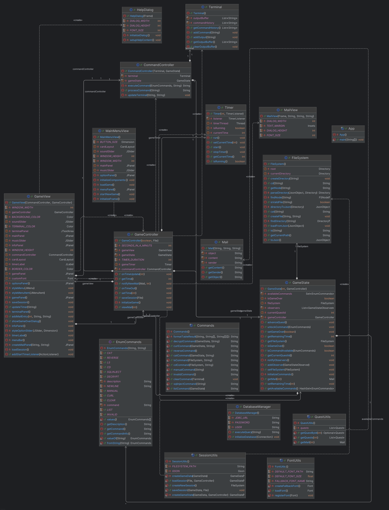

# System Breach - Caso di studio

## Descrizione del caso di studio

System Breach è un'avventura testuale che simula un ambiente hacking in cui il giocatore deve sventare il sabotaggio di una centrale nucleare. Il gioco implementa un'interfaccia simile ad un terminale attraverso cui il giocatore può utilizzare comandi Unix-like (ls, cd, cat) e tool di hacking specializzati (sqlmap, fcrackzip) per completare le missioni. La progressione è guidata da un sistema di mail e il giocatore ha 30 minuti di tempo per completare l'obiettivo.

Il progetto è sviluppato seguendo il paradigma OOP e utilizza il pattern MVC (Model-View-Controller) per separare le responsabilità tra i vari componenti delle classi. Questo approccio garantisce modularità, riutilizzo del codice esistente e facilità di manutenzione.

Ogni classe ha attributi specifici e metodi specializzati per gestire il comportamento degli oggetti.

L'uso di relazioni tra classi, come ereditarietà e l'aggregazione, permette di modellare le interazioni in modo efficace.
L'ereditarietò consente di definire classi generiche da cui derivano classi più specifiche, mentre l'aggregazione favorisce la creazione di relazioni tra più oggetti di altre classi.

## Diagramma delle Classi


Il progetto segue il pattern architetturale MVC (Model-View-Controller):

### Model
- `GameState`: Gestisce lo stato complessivo del gioco
- `FileSystem`: Implementa un filesystem virtuale gerarchico
- `Mail`: Rappresenta i messaggi ricevuti durante il gioco
- `Timer`: Gestisce il tempo rimanente di gioco
- `Terminal`: Mantiene la cronologia comandi e output

### View
- `GameView`: Interfaccia principale del gioco
- `MailView`: Dialog per visualizzare le mail
- `MainMenuView`: Menu principale del gioco
- `HelpDialog`: Dialog per visualizzare le istruzioni di gioco

### Controller
- `GameController`: Gestisce la logica di gioco e coordina Model e View
- `CommandController`: Elabora i comandi utente
- `SessionUtils`: Gestisce salvataggio/caricamento partite

### Util
#### commands
- `Command`: Interfaccia per i comandi utente e il loro parsing e esecuzione.
- `EnumCommand`: Enum per i comandi utente.

#### fonts
- `FontUtils`: Utilità per caricare font custom.

#### sessions
- `QuestUtils`: Utilità per gestire della progressione del gioco.
- `SessionUtils`: Utilità per gestire salvataggio/caricamento ed inizializzare la partita.

## Classi e Oggetti
Nella OOP, le classi definiscono le proprietà e i comportamenti di un oggetto, mentre un oggetto è un’istanza concreta di una classe. 

- **GameState**: Gestisce lo stato complessivo del gioco, come il tempo rimasto e i progressi del giocatore. Oggetti di questa classe racchiudono dati e metodi per gestire la logica di avanzamento.
- **FileSystem**: Modella un filesystem virtuale gerarchico, con metodi che simulano comandi (ls, cd, cat) e gestiscono file e directory. Ogni istanza rappresenta uno specifico stato del filesystem.
- **Terminal**: Gestisce l’interfaccia testuale, memorizza la cronologia e l’output dei comandi. Un oggetto Terminal fornisce i metodi per mostrare i risultati e ricevere input.
- **Mail**: Rappresenta i messaggi o notifiche ricevute durante il gioco. Ogni istanza racchiude informazioni come mittente, destinatario e contenuto.
- **Command** (interfaccia) e **EnumCommand** (enum): Definiscono l’insieme delle azioni che il giocatore può eseguire, come l’elaborazione di comandi Unix-like o tool di hacking. Oggetti derivati da Command implementano logiche di esecuzione diverse.
- **Timer**: Si occupa del tempo rimanente di gioco, definendo quando il tempo a disposizione sta per esaurirsi.

Ciascuna classe incapsula i propri dati e metodi, così da isolare le responsabilità e rendere il codice più manutenibile. Gli oggetti creati da queste classi interagiscono scambiandosi messaggi (chiamate ai metodi), permettendo al giocatore di svolgere le missioni e interagire con l’interfaccia testuale.

## Incapsulamento
L’incapsulamento consiste nel nascondere i dettagli interni di una classe, rendendo accessibili solo alcune parti tramite metodi pubblici (getter e setter). Ciò protegge i dati interni e controlla come vengono letti o modificati.

- **Timer**: Gestisce il tempo rimanente di gioco
- **GameState**: Gestisce lo stato complessivo del gioco
  - Entrambe proteggono i campi interni (es. `isRunning`, `timeRemaining`), esponendoli con metodi pubblici sicuri.

## Astrazione
L’astrazione nasconde la complessità interna e fornisce un’interfaccia semplice per l’uso di un oggetto. L’utente può invocare metodi senza conoscere i dettagli implementativi.

- **Command**: Interfaccia per i comandi utente e il loro parsing e esecuzione.
- **FileSystem**: Implementa un filesystem virtuale gerarchico
  - Offrono metodi (p.es. `execute()`, `ls()`) che nascondono la logica di interpretazione o gestione dei file.

## Polimorfismo
Il polimorfismo consente di usare lo stesso metodo in contesti diversi, o di trattare oggetti di classi derivate come fossero di una classe base.

- **EnumCommand**: Enum per i comandi utente.
- **Command** con implementazioni diverse (CdCommand, LsCommand, ecc.) che condividono la stessa interfaccia
  - Ogni comando può essere richiamato allo stesso modo, pur avendo comportamenti specifici.

## Responsabilità Separate
Ogni classe gestisce un aspetto diverso del gioco (GameController coordina la logica, FileSystem la struttura dei dati, etc.)


## Specifica Algebrica: FileSystem

### Sorts
- FileSystem
- Path (String)
- Content (String)
- Node
- Directory
- File

### Operators
```
createFS: → FileSystem
createFile: FileSystem × Path × Content → FileSystem
createDir: FileSystem × Path → FileSystem
ls: FileSystem × Path → Set<String>
cd: FileSystem × Path → FileSystem
cat: FileSystem × Path → Content
```

### Axioms
Per ogni fs ∈ FileSystem, p,p1,p2 ∈ Path, c ∈ Content:

```
ls(createFS(), "/") = ∅
ls(createDir(fs, p), p) = ∅
ls(createFile(fs, p, c), parent(p)) = ls(fs, parent(p)) ∪ {basename(p)}
cat(createFile(fs, p, c), p) = c
cd(createDir(fs, p1), p1).getCurrentPath() = p1
```

## Implementazione

### Threads
Nel progetto, la gestione del tempo rimanente avviene tramite un thread dedicato. La classe `Timer` implementa l'interfaccia `Runnable`, avviando il proprio ciclo di decremento in un thread separato. Quando il tempo si esaurisce, il timer notifica il listener di riferimento.

// Esempio di avvio del thread nella classe Timer
```java
// snippet da Timer.java
public void start() {
    isRunning = true;
    timerThread = new Thread(this);
    timerThread.start();
}

@Override
public void run() {
    while (isRunning && currentTime > 0) {
        // ...  ...
        currentTime--;
        listener.onTimeUpdate(currentTime);
        // ...  ...
    }
}
```

### Lambda Expressions
```java
// Filtering comandi disponibili
Stream.of(EnumCommands.values())
    .filter(cmd -> gameState.isCommandAvailable(cmd))
    .map(EnumCommands::getCommand)
    .collect(Collectors.joining(" "))

// Event handling UI
closeButton.addActionListener(e -> dispose())
```

### GUI
Per la GUI è stato Swing perché fa parte della libreria standard di Java, offrendo un set di componenti grafici subito disponibili e facilmente integrabili. Non richiede dipendenze esterne, consentendo un rapido prototipo dell’interfaccia utente e garantendo portabilità su diverse piattaforme.

### File
I file vengono utilizzati per memorizzare in modo persistente i dati di gioco (come lo stato del filesystem e i progressi del giocatore), spesso in formato JSON. Ciò garantisce la continuità tra diverse sessioni.

// Esempio di salvataggio della sessione in formato JSON
```java
// snippet da SessionUtils.java
public static void saveSession(GameState gameState, File saveFile) {
    try (FileWriter writer = new FileWriter(saveFile)) {
        GameData saveData = createGameData(gameState);
        GSON.toJson(saveData, writer);
    } catch (IOException e) {
        System.err.println("Errore salvataggio sessione: " + e.getMessage());
    }
}
```

### JavaDoc
La documentazione del codice è stata generata utilizzando JavaDoc. È possibile consultare la documentazione completa delle classi [qui](./javadoc/index.html).

